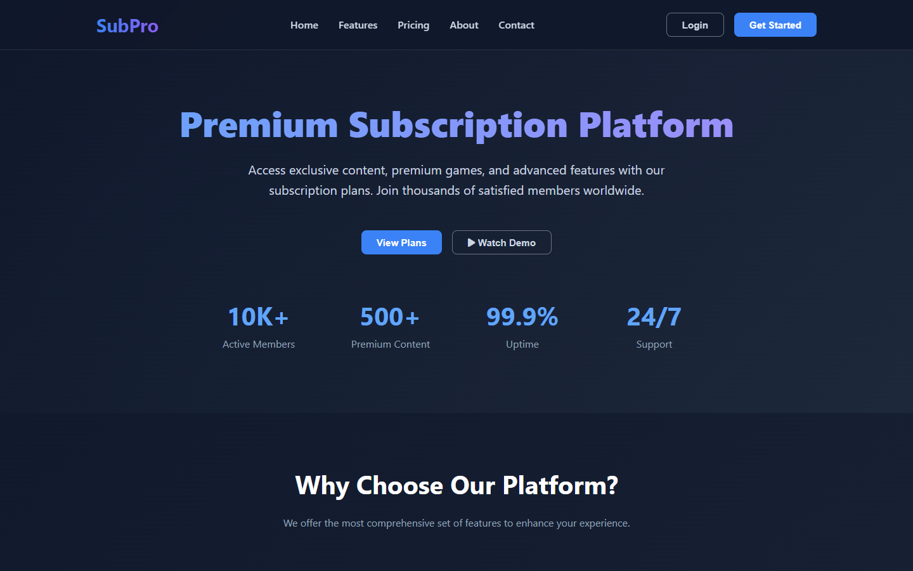
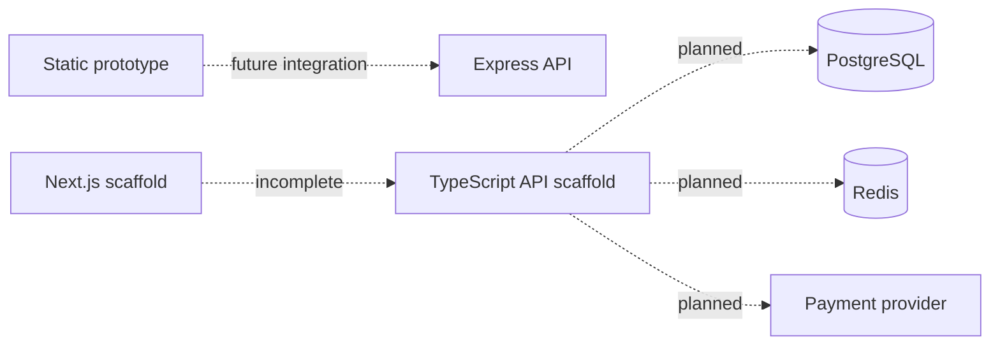

# SubPro

> An early subscription-platform interface and API exploration.

[](#project-status)
[](https://nodejs.org/)
[](#license)

[Overview](#overview) | [Run locally](#run-locally) | [Architecture](#architecture) | [Roadmap](#roadmap) | [Issues](https://github.com/itsmebillah/SubPro/issues)

## Overview

SubPro explores pricing, registration, and subscription user journeys. The repository currently contains a standalone HTML prototype, a minimal Express API, and partial Next.js and TypeScript scaffolding. It is a learning prototype, not a deployable billing product.



## What Works

- Responsive static landing page with monthly and annual pricing states
- Login and registration interaction prototypes in the browser
- Minimal Express server exposing plan and subscription-response endpoints
- TypeScript API scaffold with health and plan routes
- Initial Next.js component structure

## Project Status

Authentication, persistence, payments, content management, notifications, and administration are placeholders. The Docker configuration describes an intended architecture, but the nested applications do not yet contain complete dependency manifests or production integrations. Do not process real credentials or payments with this project.

## Technology

| Area | Current implementation |
| --- | --- |
| Prototype UI | HTML, CSS, JavaScript |
| Root API | Node.js, Express |
| Application scaffold | Next.js, TypeScript |
| Planned infrastructure | PostgreSQL, Redis, Docker |

## Run Locally

```bash
git clone https://github.com/itsmebillah/SubPro.git
cd SubPro
npm install
npm start
```

The API starts at `http://localhost:3000`. Open `index.html` separately to inspect the static interface. The API and static prototype are not wired together.

## Architecture



## Repository Structure

```text
.
|-- index.html              # Standalone interactive prototype
|-- backend.js              # Runnable minimal Express API
|-- backend/                # Incomplete TypeScript API scaffold
|-- frontend/               # Incomplete Next.js scaffold
`-- docker-compose.yml      # Proposed local service topology
```

## Roadmap

- Choose one frontend and backend implementation path
- Complete and lock dependency manifests
- Add persistent data models and migrations
- Implement real authentication with secure session handling
- Integrate a payment provider using server-side secrets and webhooks
- Add automated tests before deployment

## Security

Use only placeholder values from `backend/.env.example`. Never commit an actual JWT secret, database password, or payment credential. The mock checkout response is not a payment implementation.

## License

No open-source license has been selected. All rights remain with the repository owner unless a license is added.

---

**Md. Masum Billah** · Data Analyst | Automation Developer | Business Intelligence Specialist

[Portfolio](https://itsmebillah.github.io/) · [GitHub](https://github.com/itsmebillah) · [Email](mailto:itsmbillah@gmail.com) · [Related Projects](https://github.com/itsmebillah?tab=repositories) · [Issues](https://github.com/itsmebillah/SubPro/issues)
